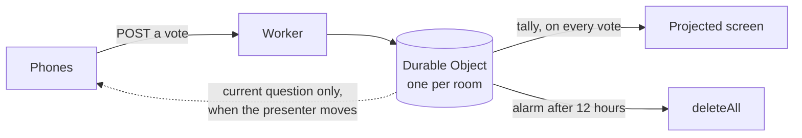

# pollen

**Ask a room a question and watch the answers arrive, without anyone signing in to
anything.**

Multiple choice, rating scales and word clouds for a talk or a class. The room joins by
typing a six-character code or pointing a phone at a QR code, answers on the phone, and
the results build up on the projected screen. There is no account, no cookie, no
analytics and no request to any third party. The room deletes itself when the session is
over.

For anyone who runs workshops, lectures or seminars and wants the live-poll part without
handing an audience to a commercial platform.

🔗 **Live:** https://pollen.rijdho.org

Available in **English, German and Spanish** (auto-detected, switchable), with a light
and a dark theme.


## What it does

Three kinds of question, chosen when the room is created:

- **Multiple choice.** Up to eight options, single or multiple selection. Bars with whole
  percentages that add up to exactly 100.
- **Rating scale.** Two to ten steps with labels at each end. Histogram with the mean
  drawn where it actually falls, plus the median and the number of answers.
- **Word cloud.** One to three short entries per person, merged by spelling, sized and
  weighted by how often they were said.


The presenter moves the room from one question to the next, can stop and reopen answers,
clear a question, download the results as JSON, or end the session and delete everything.


### Free-text answers wait for approval

Whatever a room types goes on a wall in front of everyone, so word-cloud entries are held
in a queue until the presenter approves them, one by one. It defaults to on, and turning
it off is a deliberate act by the person standing next to the screen.

Entries are folded before a moderator ever sees them: bidirectional override characters
are stripped, because they reorder what is *displayed* without changing the string, so a
moderator could approve one thing and the room could read another. Zero-width characters
go too, since they let one word masquerade as two. Stacked combining marks are capped so
an entry cannot spill out of its row.

## How it works

One Cloudflare Worker serves the whole thing, and each room is one
[Durable Object](https://developers.cloudflare.com/durable-objects/) holding a small
SQLite database with the questions, the votes and nothing else. When the room's alarm
fires, twelve hours after it opened, the object deletes itself.



The split in that diagram is the whole design. Every WebSocket message is a billed
request, so what is broadcast to the whole room has to be rare:

- the **presenter's** socket gets the full tally on every single vote, and there is one
  of it;
- the **phones** get the current question and nothing else, pushed only when the
  presenter actually moves, which is perhaps ten times in a session.

Phones never receive the running results. That is a deliberate limitation and the reason
this fits in a free plan at all.

### What it costs to run

A workshop of 200 people answering 10 questions, counted against Cloudflare's free daily
allowance of 100,000 requests:

| Approach | Requests for that session | Share of a day |
|---|---:|---:|
| This design | about 6,200 | 6% |
| Phones poll every 3 seconds | about 240,000 | 240% |
| Tally pushed to every phone on every vote | about 400,000 | 400% |

Serving the page itself costs nothing: static asset requests are free and unlimited, and
a navigation request does not invoke the Worker at all, so someone typing the join
address is not a billed request. Durable Objects hibernate between votes, so a room that
sits open through a two-hour session is not billed for the waiting.

### What is stored, and for how long

Per room: the questions, one row per answer, and one row per device that has answered.
The device row holds an opaque token the browser generated for itself, so that a second
answer replaces the first rather than counting twice. No address, no fingerprint, no
account, nothing that identifies a person. The presenter's key to their own room lives in
their browser's local storage and nowhere else.

## Tests

```bash
npm test          # 45 unit tests, no dependencies, Node's own runner
npm run dev       # in one terminal
npm run live      # 56 end-to-end checks against the running Worker
```

The unit tests cover the parts where a silent mistake would still render: percentages
that must sum to 100, a median that has to be a step someone could have chosen, the
character folding above, the QR encoder against a matrix that was verified once by
decoding it with an independent implementation, dictionary parity across the three
languages including the placeholders inside each string, and the module graph's version
pinning.

The suite was checked against seventeen deliberately planted defects and killed all of
them, including one round of it that killed only sixteen and exposed a test asserting
something it did not mean.

## Run locally

```bash
npm install
npm run dev       # http://127.0.0.1:8788
```

No build step for the browser: the platform serves the files as they are, so what is
deployed is what is in the repository.

## Deploy

```bash
npm run deploy    # runs the tests first, then wrangler deploy
```

The Worker serves its own static assets, which means it can send real response headers
rather than a `<meta>` policy, and therefore carries a `Content-Security-Policy` that
starts at `default-src 'none'` and includes `frame-ancestors`. It was verified in a
browser by trying to breach it: an external `fetch`, a font-CDN stylesheet, an external
script, an inline script and a `style` attribute were all blocked, while the same-origin
WebSocket and `element.style` sizing kept working.

Inter is self-hosted. No font CDN is linked here, ever: it would send every visitor's IP
to that host, and a strict `font-src` blocks it silently anyway.

### What is defended, and what is not

Enforced: a Content-Security-Policy starting at `default-src 'none'` with `frame-ancestors`,
HSTS, `nosniff`, `no-referrer` and a `Permissions-Policy` that turns off every device API;
the admin key compared in constant time; every participant input re-checked and folded on
the server; twenty answers a minute per device; five hundred devices and seven hundred
sockets per room; thirty rooms an hour per address; and no third-party request of any kind,
which is verifiable in a browser's network panel rather than taken on trust.

Not defended, deliberately: **who** is answering. See the first caveat below. The tool also
has no bot detection and no CAPTCHA, because both would mean either a third-party script or
a fingerprint, and this page has neither.

One honest wrinkle: a browser cannot set headers on a WebSocket handshake, so the
presenter's key travels in the query string for that one request. It is otherwise sent as a
header. `Referrer-Policy: no-referrer` keeps it out of referrers, but it can appear in edge
logs, which is a real difference from the header path and is written down here rather than
glossed over.

## Caveats

- **A device token is not an identity.** It stops accidental double voting and gives an
  honest count of how many devices answered. Anyone who wants to vote twice can clear
  their browser storage or open a private window, and anyone willing to write a script can
  mint fresh tokens and fill a room to its 500-device ceiling, whether to stuff the result
  or simply to leave no room for anybody else. Rate limits slow that down; they do not stop
  it. There is no way around it without accounts, and accounts are the thing this tool
  exists to avoid. **Do not use it where the result has consequences.** A limit tight
  enough to stop a script would also turn away a lecture hall arriving at once, which is
  the case this exists to serve, so that trade has been made deliberately and in this
  direction.
- **Anyone with the code can answer.** The code is the only barrier and it is on a screen
  in a public room. It is six characters from a 28-character alphabet, so it cannot
  usefully be guessed from outside, but it is not a secret.
- **Phones do not see the results.** By design, as above. If a room needs everyone to see
  the tally on their own device, this is the wrong tool.
- **Lose the browser, lose the room.** The key to a room lives in local storage. There is
  no account to recover it from, and nobody at the other end can restore it.
- **Moderation is a person, not a filter.** There is no profanity list and no
  classifier. What protects the projector is that someone reads each entry before it
  appears. Leave it on.
- **Twelve hours, then it is gone.** Download the results during or after the session.
  Nothing is recoverable afterwards, including by the person who ran it.
- **Word clouds flatten meaning.** Merging by spelling puts "access" and "Access" in one
  bubble, and leaves "open access" and "access" in two. The size of a word says how often
  it was typed and nothing else.

## License

AGPL-3.0-or-later. Copyright (c) 2026 Ricardo Hartley.

The whole application is served to the browser, so the licence is the only thing that
governs what happens to a copy of it. Section 13 covers use over a network: anyone who
runs a modified version as a service owes its source back to the people using it. Chosen
before the first public commit rather than switched later, because a copy taken under one
licence keeps those terms for good.

The QR encoder in `public/js/vendor/` is Kazuhiko Arase's, under MIT, with its notice
intact.
